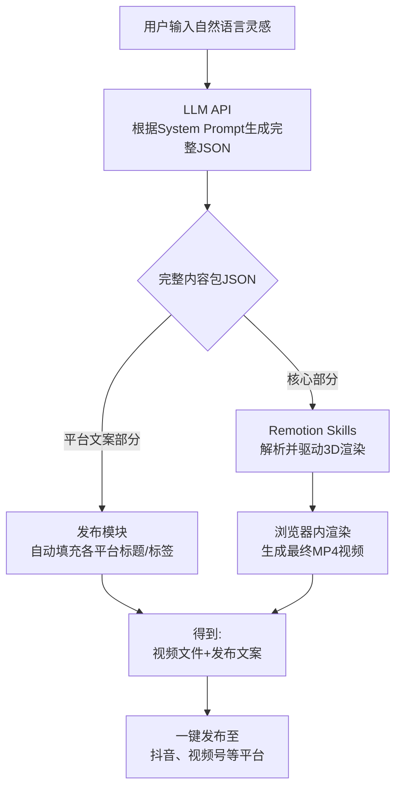

为了将“AI深度明信片”创意扩展为可直接用于发布的完整内容包，以下是一个集成了**完整文案**、**平台标签**、**视觉与音频参数**的结构化JSON需求。

### 📄 完整内容生成需求 (`COMPLETE_CONTENT_SPEC.json`)

此JSON定义了从用户的一句灵感输入，到生成可用于视频渲染和跨平台发布的**全量内容数据**的结构。

```json
{
  "contentGenerationSpec": {
    "_comment": "定义从一句用户自然语言输入，生成完整视频内容包的规范。",
    "inputExample": "生成一个关于‘春天与遗忘’的、带有胶片质感的哲学明信片",
    "outputTargets": [
      "驱动Remotion + Three.js渲染3D视频",
      "提供抖音/视频号发布的完整文案",
      "为后续自动化发布提供元数据"
    ]
  },
  "completeOutputSchema": {
    "metadata": {
      "contentId": {
        "description": "内容唯一标识，用于归档和追踪",
        "type": "string",
        "generationRule": "timestamp + '_' + 主题词hash (如: 20240521_080306_a1b2c3d4)"
      },
      "generationTimestamp": {
        "description": "内容生成的UTC时间戳",
        "type": "string",
        "format": "ISO 8601"
      },
      "sourceInspiration": {
        "description": "用户原始的自然语言输入",
        "type": "string"
      },
      "targetPlatforms": {
        "description": "计划发布的目标平台",
        "type": "array",
        "items": {
          "type": "string",
          "enum": ["douyin", "wechat_channel", "youtube_shorts"]
        },
        "default": ["douyin", "wechat_channel"]
      }
    },
    "coreContent": {
      "title": {
        "description": "视频的核心标题/主题句，最具冲击力和传播性，用于视频内显式展示和发布标题",
        "type": "string",
        "characterLimit": 20,
        "example": "春天记得所有被遗忘的雨"
      },
      "coreText": {
        "description": "明信片的主体文案，即AI生成的深度句子。可分段用于视频中的序列动画。",
        "type": "array",
        "items": {
          "type": "string",
          "description": "文案的一个段落或句子"
        },
        "example": ["人们总在春天谈论新生，", "却忘了泥土里还躺着去岁枯叶的记忆。", "遗忘不是消失，是春天代为保管。"]
      },
      "extendedDescription": {
        "description": "对核心思想的扩展阐述，用于视频号长文案或YouTube描述区。",
        "type": "string",
        "characterLimit": 300,
        "example": "这支短片献给所有在崭新季节里，仍惦记着旧故事的人。春天并非覆盖过去，而是让遗忘在另一维度生长。你的心中，是否也有一场被‘春天’保管的雨？"
      }
    },
    "platformCopy": {
      "forDouyin": {
        "postTitle": {
          "description": "抖音发布时的标题（可结合标题和标签）",
          "type": "string",
          "characterLimit": 55,
          "generationRule": "【核心标题】+ 1-2个高热度话题标签",
          "example": "春天记得所有被遗忘的雨 #治愈系 #哲学"
        },
        "hashtags": {
          "description": "抖音话题标签，按热度、相关度排序",
          "type": "array",
          "items": {
            "type": "string"
          },
          "minItems": 3,
          "maxItems": 8,
          "example": ["#治愈系", "#哲学", "#情感文案", "#春天", "#原创动画", "#AI绘画"]
        },
        "interactionPrompt": {
          "description": "评论区互动引导文案",
          "type": "string",
          "example": "“你的记忆里，最深刻的春天是哪一年？” 在评论区告诉我吧。"
        }
      },
      "forWeChatChannel": {
        "postTitle": {
          "description": "视频号发布标题，可更文艺、含蓄",
          "type": "string",
          "characterLimit": 60,
          "example": "遗忘的另一种形式：当春天成为记忆的保管者"
        },
        "hashtags": {
          "description": "视频号标签（功能同话题）",
          "type": "array",
          "items": {
            "type": "string"
          },
          "example": ["#AI明信片", "#深度思考", "#文字的力量"]
        }
      }
    },
    "visualAndAudioSpec": {
      "styleKeywords": {
        "description": "用于引导Remotion Skills选择视觉风格的词语",
        "type": "array",
        "items": {
          "type": "string"
        },
        "example": ["胶片质感", "柔焦", "浅景深", "复古色调", "微光粒子"]
      },
      "colorPalette": {
        "description": "主色调方案，CSS颜色值或描述词",
        "type": "object",
        "properties": {
          "primary": {
            "type": "string",
            "example": "线性渐变(135deg, #a8edea 0%, #fed6e3 100%)"
          },
          "secondary": {
            "type": "string",
            "example": "#6a5acd"
          },
          "textColor": {
            "type": "string",
            "example": "#2c3e50"
          }
        }
      },
      "animationMood": {
        "description": "动画的整体情绪和节奏",
        "type": "string",
        "enum": ["宁静舒缓", "深沉思考", "温柔治愈", "诗意流淌", "空灵神秘"],
        "example": "诗意流淌"
      },
      "musicSuggestion": {
        "description": "背景音乐风格或关键词，用于后期匹配",
        "type": "string",
        "example": "简约钢琴独奏，略带环境音效，节奏缓慢"
      }
    },
    "llmGenerationContext": {
      "systemPrompt": {
        "description": "用于引导LLM生成上述完整内容的系统指令（关键部分）",
        "type": "string",
        "template": "你是一位哲思诗人兼短视频内容策略师。请根据用户灵感，生成一份完整的短视频内容包。需要包括：1)一个有力的核心标题；2)三段式主体文案（每段不超过15字）；3)一段扩展描述；4)为抖音和视频号分别准备带话题的发布标题和标签；5)提供视觉风格、色彩和动画情绪的关键词。整体风格需统一、有深度且易于视觉化。"
      }
    }
  }
}
```

### 🚀 集成与使用流程

有了这个完整的内容包，你的“AI深度明信片”系统工作流将升级如下：



1.  **生成**：用户输入灵感后，系统将上述 `llmGenerationContext.systemPrompt` 连同用户输入发送给LLM API，并要求LLM严格按`completeOutputSchema`返回JSON。
2.  **渲染**：`coreContent` 和 `visualAndAudioSpec` 部分直接注入你之前设计的Remotion Skill（如 `create3DPostcard`），驱动视频生成。
3.  **发布**：视频渲染完成后，系统自动读取 `platformCopy` 下对应平台（如`forDouyin`）的文案，与视频文件一并准备好，或通过自动化脚本上传。

### 💡 核心优势与扩展建议

*   **一体化产出**：一次AI调用，解决从创意到发布的所有文案需求，保证内容调性高度统一。
*   **平台差异化**：针对抖音、视频号等不同平台的用户习惯和流量规则，生成最合适的标题和标签，最大化传播效果。
*   **未来扩展**：此结构易于扩展。未来若想增加**小红书**或**B站**发布，只需在 `platformCopy` 下添加对应的字段即可。

